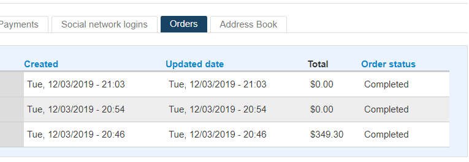
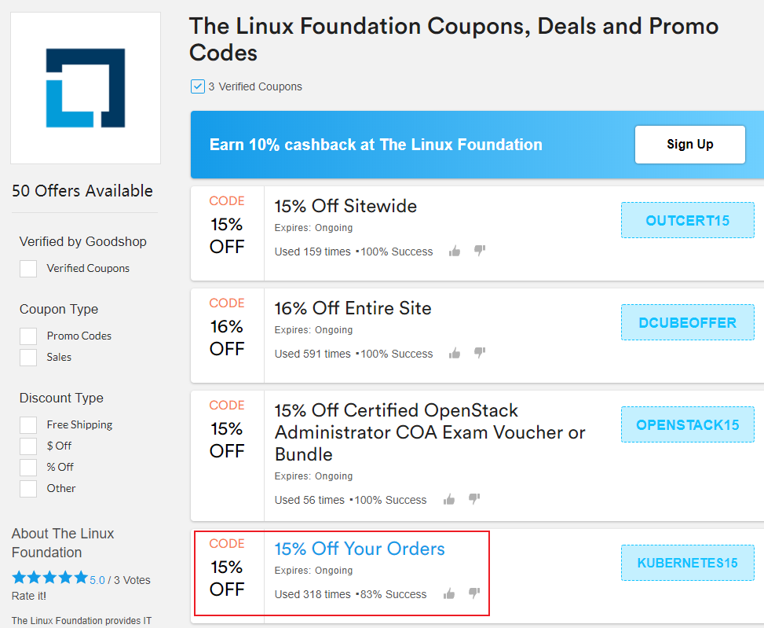
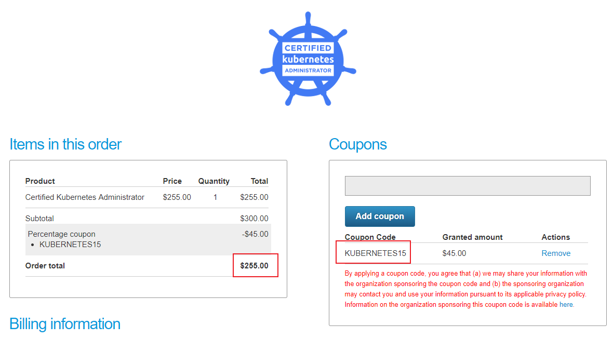
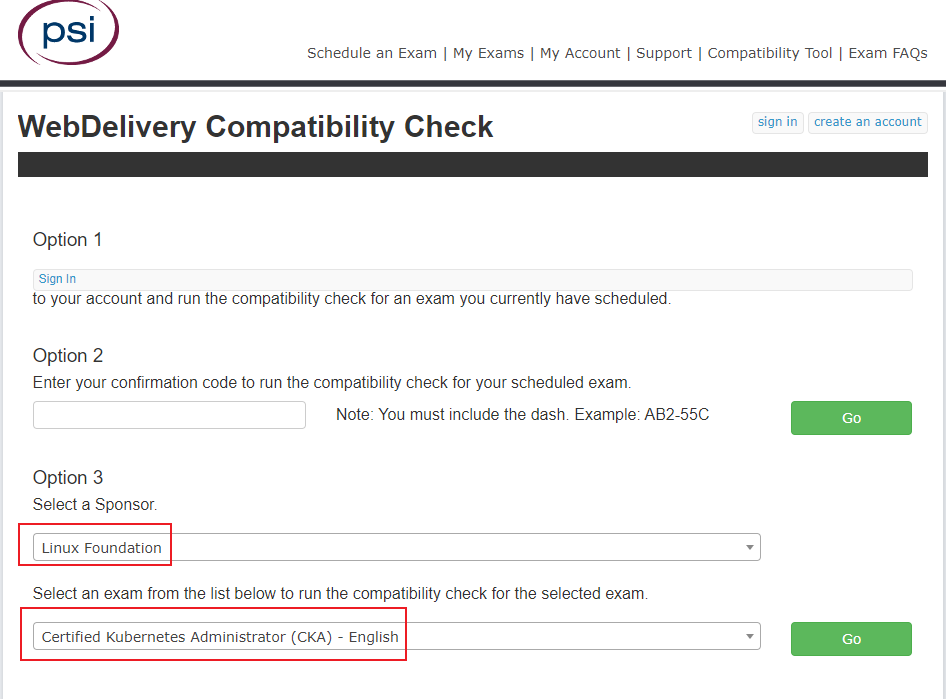
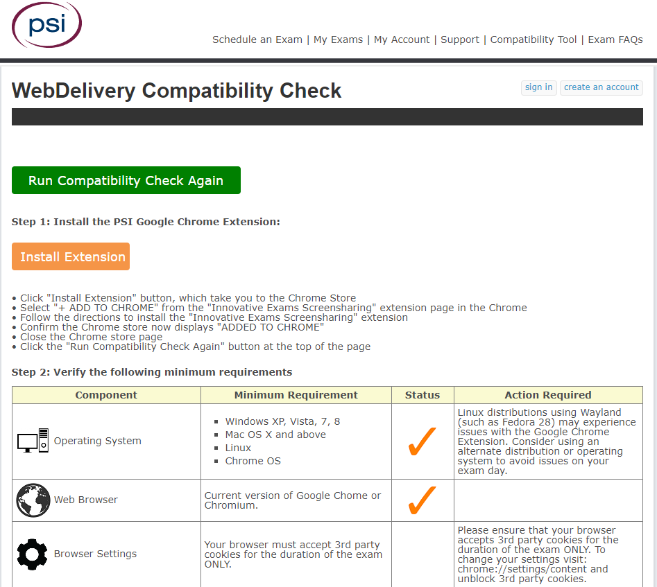

# CKA、CKAD考试经验

**CKA：**Kubernetes管理员认证（CKA）旨在确保认证持有者具备履行Kubernetes管理员职责的技能，知
识和能力。 CKA认证可帮助经过认证的管理员在就业市场中快速建立自己的信誉和价值，并能帮
助公司更快地雇用高质量的团队来支持他们的发展  

如果企业想要申请[KCSP](https://www.cncf.io/certification/kcsp/)条件之一是：至少需要三名员工拥有CKA认证  

 **CKAD：**Kubernetes应用程序开发人员认证（CKAD）旨在确保CKAD具备履行Kubernetes应用程序开发
人员职责的技能，知识和能力。 经过认证的Kubernetes Application Developer可以定义应用程序
资源并使用核心原语来构建，监视和排除Kubernetes中可伸缩应用程序和工具的故障  

 

这里主要和大家分享一下考试报名优惠、如何备考和考试注意事项  


# 考试报名

**报名地址：**

- [CKA](https://www.cncf.io/certification/cka/)

- [CKAD](https://www.cncf.io/certification/ckad/)

报名成功之后，可在12个月之内进行考试，考试不过有一次补考机会。

*注意：需要有美元币种信用卡（Visa之类），如过没有可以叫亲朋好友帮付款或者考虑中文监控考试（支持支付宝付款）*


**获取证书条件**

CKA：74分或以上可以获得证书；CKAD：66分或以上可以获得证书  


**关于中文监考：**

CKA有中文监考监控员会中文，报名费可以支持支付宝付款

CKAD暂时没发现有中文监控

[中文监控报名流程](https://training.linuxfoundation.cn/faq#14)


**国内现场考点：**

如果你没有合适的考试环境，可以考虑到现场考点去考试，我没去过现场考点，具体请咨询说明里面的考点电话

[国内考点说明](https://training.linuxfoundation.cn/faq#13)


**报名优惠：**

每年Cyber Monday（网络星期一，也就是黑五后的第一个星期一）有优惠，买课程送考试报名资格。我在19年的网络星期一卖了CKA+CKAD的课程（送考试资格）共花费350美金，单卖一门课程优惠价是180美金  

单个课程原价是299美金，平时课程和考试资格是分开卖的    

购买课程后会将考试报名优惠码（100%优惠，就是不用再付费了，抵消300美金的考试报名费）发到邮箱，报名优惠码有效期为一个月，使用优惠码报名之后12个月内进行考试  

如下图，最下面那个349美金的订单是购买CKA+CKAD的课程套餐，上面两个订单是用购买课程送的优惠码下的CKA和CKAD考试报名订单  




如果你等不及Cyber Monday，可以找一下国内培训机构，可能他们手上有优惠报名资格。

或者在这个[这里](https://www.goodshop.com/coupons/the-linux-foundation)查看一下优惠码，不同时候看折扣不一样，有时候是9折，有时候是85折，例如现在（2020-01-24）是85折，如下图所示：




用这个优惠码去报名试一下：（省了45美金）




# 备考  

考试时你可以打开两个浏览器Tab，一个是考试窗口，一个用来查阅官方文档（仅允许访问https://kubernetes.io/docs/、https://github.com/kubernetes/ 和https://kubernetes.io/blog/ ）

*注意：在官方文档搜索时，结果有可能并不是在https://kubernetes.io/docs/和https://kubernetes.io/blog/子域下，不能在考试中点开*

github上分别有两个关于CKA和CKAD练习的仓库。如果你只看官方文档，能够完成仓库里面的题目，考过线是没有问题的。（练习过程中不要直接去答案里面复制yaml，应该去官方文档查找复制，熟悉相关内容在官方文档的位置）

[CKA练习](https://github.com/stretchcloud/cka-lab-practice)、[CKAD练习](https://github.com/dgkanatsios/CKAD-exercises)

除了上面的练习题，还需要熟悉了使用[kubeadm](https://kubernetes.io/docs/setup/production-environment/tools/kubeadm/create-cluster-kubeadm/)创建集群


练习环境：[katacoda](https://www.katacoda.com/courses/kubernetes/kubectl-run-containers)

建议大家至少在这个k8s环境里练习一次，主要是熟悉一下web终端和卡顿的网络。


# 考前检查及考试环境

- **考试形式：**在线监控，需要共享桌面和摄像头  

- **考试环境：**在一个密闭空间，例如书房、卧室、会议室等，电脑屏幕不能对着窗户，房间里除了考生不能存在第二个人，考试的桌面不能方其它东西，水杯也不行  

- **考试时间及题目：**CKA-3小时-24道题、CKAD-2小时-19道题

- **选择考试时间：**报名成功之后可以在12个月之内进行考试，考试之前需要选择考试时间，选择考试时间的时候记得先选择北京时区，默认是0时区时间。

- **电脑要求：**可以在这里[WebDelivery Compatibility Check](https://www.examslocal.com/ScheduleExam/Home/CompatibilityCheck)检测自己的电脑环境和网络速度等

  

  检查测试前先点击“Install Extension”，安装chrome插件，这个插件是考试时用来共享屏幕和摄像头的，安装过程需要爬墙，考试过程不需要爬墙。

  

- **考试前考官检查：**

  - 考试可以提前15分钟进入考试界面
  - 考官会以发消息的方式和你交流（没有语音交流）
  - 看不懂考官发的英文怎么办：可以在chrome浏览器右键翻译
  - 考官会让你共享摄像头，共享桌面
  - 考官会让你出示能确认你身份ID的证件，我当时用的是罗技C310摄像头，无法对焦，护照看上去模糊到不行，后来考官又叫我给护照打光还是不行，后面又叫我打开我的手机，用手机相机当作放大镜用，这样才能看清楚。（我考CKAD的时候，我护照还没举稳，考官就说可以了，应该是考过CKA，他们系统里面已经有我的信息了，就随便瞄了一眼而已）
  - 考官会让你用摄像头环视房间一周，确认你的考试环境（当时我房间门开了一个小缝也要求我去把门关好，还是比较严格）
  - 考官会让你用摄像头看你的整个桌面和桌子底下
  - 考官会让你再次点一下桌面共享，然后你叫你点击取消，然后就开始进入考试了

- **考试的界面：**

  - 左边是题目
  - 右边是终端
  - 终端上面是共享摄像头、共享屏幕、考试信息等按钮（可以唤出记事本）

- **考试过程：**

  - 考试计时：按照你实际开始时间开始计时（进入有题目的考试界面开始计算）。比如你约的是下午两点开始考试，但是考官检查花了比较长的时间，到两点半才说可以进入考试，那么你的考试是从两点半开始算起  
  - 考试题目有好几种语言的翻译（包含了中文翻译），题目里的关键词都是标红的，比如pod name等等，建议看英文版的题目，中文翻译感觉是机翻的，读着有点别扭
  - 考试结束前15分钟考官会发消息提示你考试还剩下15分钟，不过这个看考官心情把，我考CKA的时候没提示了，考CKAD的时候提示了  
- 考试时间到，考官会发消息提醒你，叫你退出考试  
  
  

# 考试心得

- **考试难度**

  总的来说CKA考试还是相对简单的，如果你有k8s生产环境维护使用经验，大可以直接考试，过线是没问题的  ；CKAD难度也不大，题量较CKA大，需要注意每道题不超过6分钟

- **kubectl自动补全**

  注意使用kubectl自动补全，考试环境默认已经配置了kubectl自动补全，无需考生另行配置，但是这还不够，我们可以用`k`代替kubectl  [kubectl Cheat Sheet](https://kubernetes.io/docs/reference/kubectl/cheatsheet/)

  ```
  alias k=kubectl
  complete -F __start_kubectl k
  ```

- **使用考试环境提供的记事本**

  使用记事本，考试过程中，最好将使用过的命令记录到记事本，后面的题目可以稍微改动再使用（特别是创建pod的命令，估计要使用七八次吧）

- **使用--dry-run生成yaml**

  使用--dry-run参数来生成一个基础的yaml，再按照题目要求修改这个基础yaml文件，不要纯手写yaml。如果题目无特殊要求，能kubectl命令完成的就不要使用yaml文件，这个比较浪费时间。

- **浏览器收藏夹**

  将上面备考中的github仓库练习题中提到的官方文档保存到浏览器收藏夹，这样做的目的是在浏览器地址栏输入关键词，就会弹出收藏好的官方文档地址，就可以直达对应的文档，不需要在官方文档上再一次搜索

- **vim编辑器**

  vim编辑器要求不高，但是你至少要知道如何进入编辑模式，如何保存文档，复制粘贴之类的快捷键记不记都行，可以右键复制粘贴

- **web终端中的复制粘贴**

  web终端中无法使用Ctrl+C、Ctrl+V（考试提供的记事本可以使用），使用Ctrl + Insert，Shift + Insert代替，web终端中也可以使用右键复制粘贴

  


  

